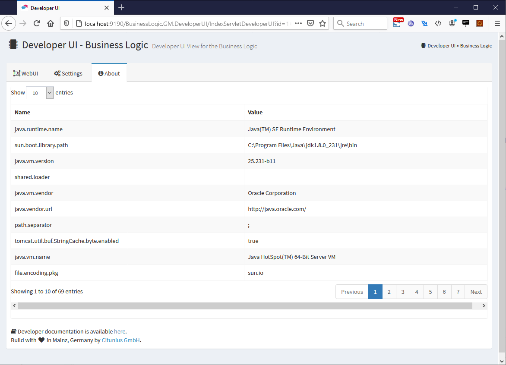

Business Logic - Developer UI
=====================

This user interface supports the implementation of custom business logics for chatbots running on the [Business Bot Platform](https://www.citunius.de/). This project provide a web UI to call functions of the business logic and start a conversation with your logic. This is helpful to implement functions easier and faster and to debug code faster. 

A business logic is a service that is connected to a chatbot in order to provide a specific service for mobile users. The chatbot defines how the message is transmitted, while the business logic decides how the message is processed. The business logic is effectively the WebApp while the Business Bot Platform is the application server such as Tomcat.

Features/Benefits
-------------------
- Invoke all functions the business logic
- Access WebUI of the business logic for configuration
- Developer UI is configure via properties file
- Start a conversation with your business logic (without running a messenger)

Please check out the [documentation](https://library.citunius.de/products/bbp_edition_community/) for
additional information on this project.

JDK 1.8 is required. Make sure your default JDK version is >=1.8
by typing `java -version`.

## How to use

1. Download and import this package in Eclipse (as project `businesslogic.developerui`)
2. Create a new business logic project (e.g. project `businesslogic.calculator`)
3. Copy template `WEB-INF/classes/config.template.properties` to `WEB-INF/classes/config.properties` in project `businesslogic.developerui`
4. Configure DeveloperUI in `WEB-INF/classes/config.properties`
5. Add business logic project `businesslogic.calculator` in your Java Build Path as required project in the project settings of the DeveloperUI project
6. Add required JARs and project `businesslogic.calculator` to classpath of Apache Tomcat

## Run

1. Add project `businesslogic.developerui` to Apache Tomcat, then `Run As` > `Run on Server` > `Finish`.
2. Open your browser and nagivate to [http://localhost:8080/businesslogic.developerui/IndexServletDeveloperUI](http://localhost:8080/businesslogic.developerui/IndexServletDeveloperUI)

## Build

Use the [Business Logic - Creator](https://github.com/citunius/businesslogic.creator) to compile business logic projects. Once compiled, deploy the business logic package on the Business Bot Platform as documented [here](https://library.citunius.de/products/bbp_edition_community/documentation/R2021-FP2116/en/administration/botadministration/businesslogics/#add-business-logic-from-a-local-file).

## Business Bot Platform Documentation
For a more detailed documentation about the Business Bot Platform, please visit: [https://library.citunius.de/products/bbp_edition_community/](https://library.citunius.de/products/bbp_edition_community/) 

# History
Initial version by [Citunius GmbH](https://www.citunius.de/)

## License
This software is under [http://www.apache.org/licenses/LICENSE-2.0](http://www.apache.org/licenses/LICENSE-2.0).

## Suggestions
Any suggestions are  welcome.